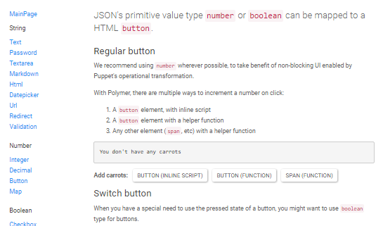

# KitchenSink

Shows how to model different UI patterns in JSON:

| String  | Number  | Boolean | Object  | Array  | Custom  |
|---|---|---|---|---|---|
|  Text |  Integer | Checkbox  |  Nested partials | Radio  | File upload  |
| Password  |  Decimal | Togglebutton  |   | Dropdown  | Set a cookie  |
| Textarea  |  Button |   |   |  Radiolist | Dialog box  |
| Markdown  | Map  |   |   | Multiselect  |  Callback behavior |
| Html  |   |   |   | Table  | Autocomplete  |
| Datepicker  |   |   |   | Datagrid  | Progress bar  |
| Url  |   |   |   |  Chart |  Lazy loading |
| Redirect  |   |   |   | Breadcrumb  | Pagination  |
| Validation  |   |   |   |   | Flash Message  |

## Requirements

This repository uses features from C# 7. Thus, **Visual Studio 2017** is required to build. An alternative is to download [Microsoft.Net.Compilers](https://www.nuget.org/packages/Microsoft.Net.Compilers/) for Visual Studio 2015.

## Developer instructions - Contributing

For developer instructions, go to [CONTRIBUTING](CONTRIBUTING.md).

## Video

Intended for 13 October 2015 webinar: http://starcounter.io/video-expressing-your-ui-in-json-plain-data-binding-advanced-data-binding/

## Screenshot

## License

MIT
